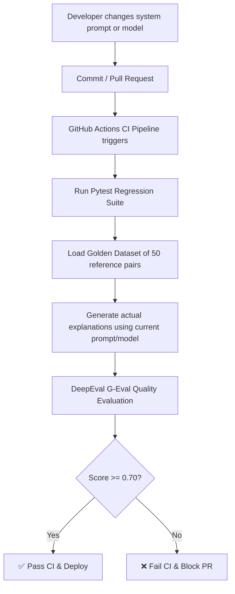

# 🛡️ Prompt Regression Testing Pipeline

[](https://github.com/your-username/prompt-regression-pipeline/actions)
[](https://www.python.org/)
[](https://docs.confident-ai.com/)
[](LICENSE)

> A continuous integration quality gate for LLM applications. Stop prompt changes or model swaps from silently degrading your production output quality.

---

## 📖 Overview

Prompt engineering is highly empirical. A tweak that improves results for one input can silently break behavior for dozens of other edge cases. 

This repository implements a production-grade **Prompt Regression Testing Pipeline** designed for a **Python Code Explainer** application. Using **DeepEval**, **pytest**, and **GitHub Actions**, it implements unit testing but for LLM output behaviors. 

Every pull request or commit automatically triggers evaluations against a hand-crafted **golden dataset of 50 input/output pairs**. If output quality scores drop below the configured threshold, the pipeline blocks deployment.

---

## 📐 Architecture & Quality Gates



### Evaluation Metric: Explanation Quality (G-Eval)
Instead of simple exact string matching (which is too brittle for LLMs), we evaluate quality using **G-Eval**, a state-of-the-art LLM-as-a-judge metric. It grades outputs on a scale from `0.0` to `1.0` based on:
1. **Accuracy**: Is the explanation factually correct based on the code snippet?
2. **Structure**: Is it formatted cleanly with markdown headers, summaries, and bullet points?
3. **Clarity**: Is it written in plain, educational language suitable for developers?
4. **Semantic Alignment**: Does it preserve the essential explanation keys defined in the golden reference explanation?

---

## 📂 Project Structure

```
├── .github/workflows/
│   └── prompt-regression.yml   # CI/CD pipeline configuration
├── src/
│   ├── __init__.py
│   ├── code_explainer.py       # Core LLM application logic
│   ├── dataset.py              # Golden dataset of 50 hand-crafted reference cases
│   └── prompts.py              # Central prompt registry (versioned)
├── tests/
│   └── test_prompt_regression.py # Pytest-DeepEval regression suite
├── .env.example                # Example environment variable template
├── .gitignore
├── requirements.txt            # Python dependencies
└── run_pipeline.py             # Local CLI runner script
```

---

## ⚡ Quick Start

### 1. Installation
Clone the repository and install the dependencies:
```bash
# Clone the repository
git clone https://github.com/your-username/prompt-regression-pipeline.git
cd prompt-regression-pipeline

# Create a virtual environment
python -m venv venv
source venv/Scripts/activate  # On Windows: venv\Scripts\activate

# Install requirements
pip install -r requirements.txt
```

### 2. Configuration
Copy `.env.example` to `.env` and fill in your OpenAI API Key:
```bash
cp .env.example .env
```
Open `.env` and configure your API key:
```env
OPENAI_API_KEY=your-actual-api-key-here
```

### 3. Run the Evaluation Suite Locally
You can run a quick evaluation subset of 5 cases or run the entire suite using the provided pipeline utility:

```bash
# Run a quick local subset check (5 cases) for speed and cost saving
python run_pipeline.py

# Run the complete regression test suite (all 50 cases)
python run_pipeline.py --all

# Run pytest directly with verbose logs showing step-by-step G-Eval scoring
python run_pipeline.py --all --verbose
```

---

## 🧪 Demonstration: Breaking the Quality Gate

To see the pipeline actively block low-quality code from deploying:

1. Open `src/prompts.py`.
2. Locate the **🚨 REGRESSION-BREAK VARIANT** comment at the bottom.
3. Uncomment the poor system prompt and comment out the production system prompt:
   ```python
   # Replace the detailed production prompt with this:
   SYSTEM_PROMPT = """You explain code. Be super brief. One sentence max. Don't explain edge cases or patterns. Skip details."""
   ```
4. Run the regression suite locally:
   ```bash
   python run_pipeline.py
   ```
5. You will see the pipeline fail because the short explanations fail to meet the structured, educational criteria defined in our quality gate. The output scores will drop below `0.7` and raise an assertion error.

---

## 🛡️ CI/CD Integration (GitHub Actions)

The repository includes a pre-configured workflow file `.github/workflows/prompt-regression.yml`. To enable automated validation on GitHub:

1. Push this repository to your GitHub account.
2. In your repository settings, navigate to **Settings** > **Secrets and variables** > **Actions**.
3. Create a **New repository secret**:
   - **Name**: `OPENAI_API_KEY`
   - **Value**: Your actual OpenAI API Key.
4. Now, every push to `main` or pull request automatically executes the full 50-case regression suite. If output quality degrades, the PR is blocked from merging.
